# APT Casino Somnia - Mermaid Architecture Diagrams

## 🏗️ System Architecture Overview

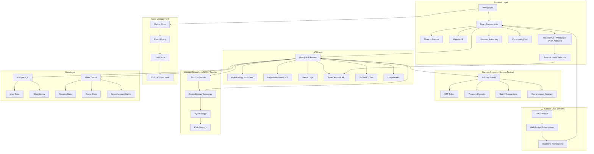

## 🔄 Application Bootstrap Flow

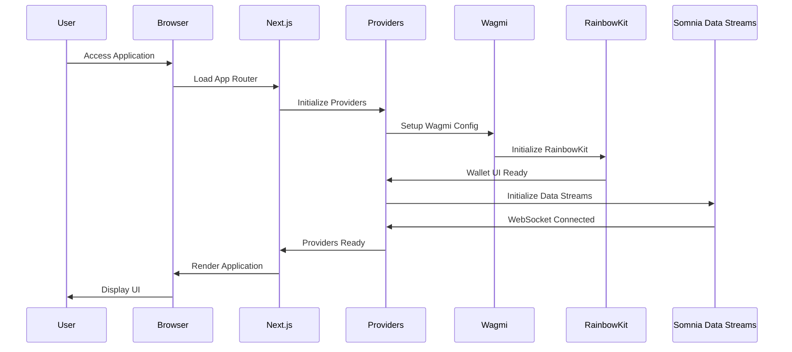

## 🔗 Wallet Connection & Smart Account Flow

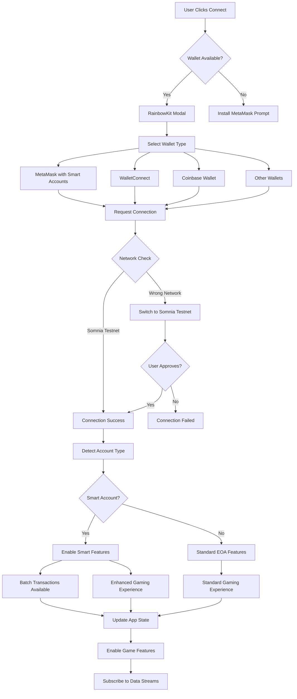

## 🔷 Smart Account Detection & Features

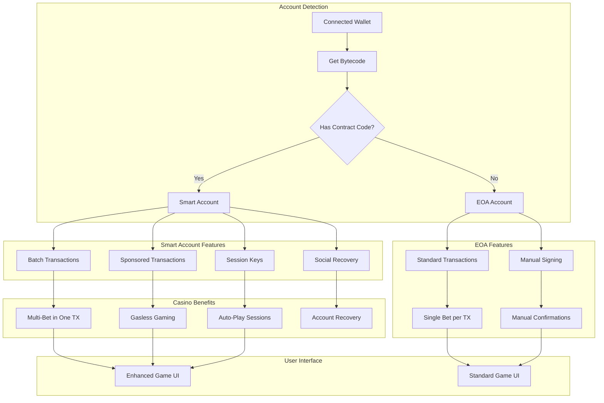

## 🌐 Multi-Network Architecture (Somnia + Arbitrum)

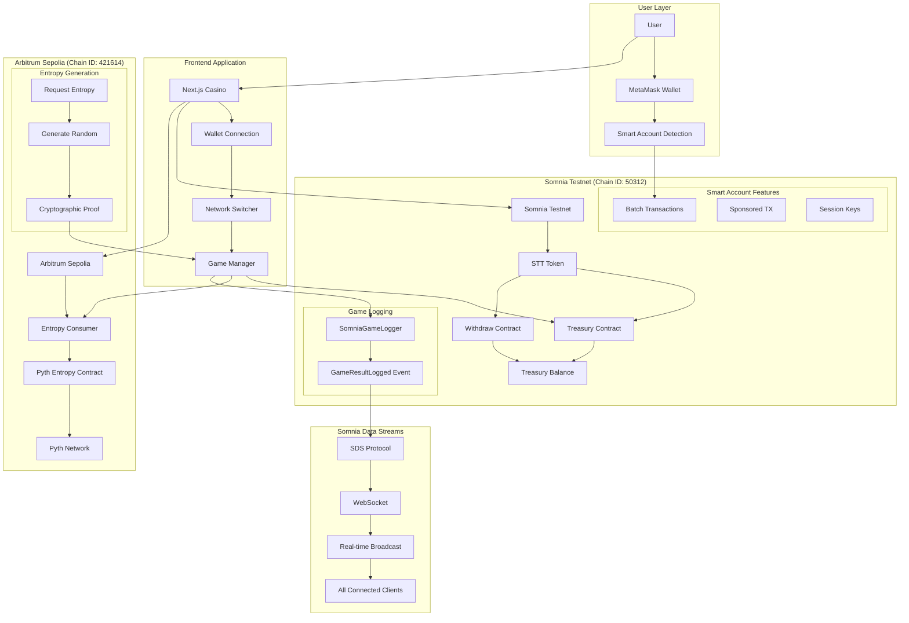

## 📡 Somnia Data Streams Architecture

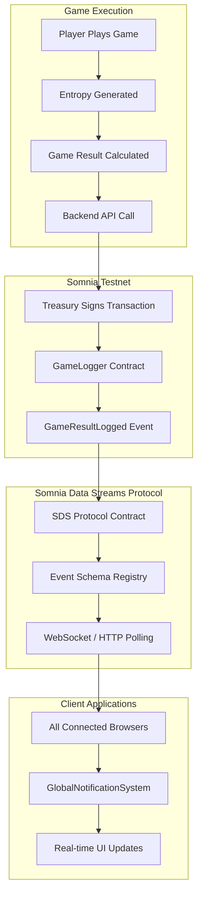

## 🔄 Somnia Data Streams Event Flow

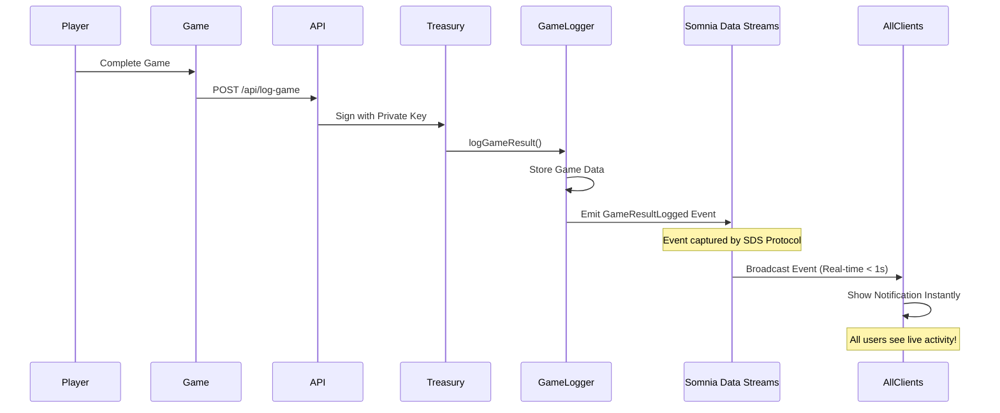

## 🎲 Pyth Entropy Integration Architecture

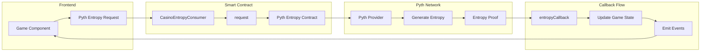

## 🎮 Game Execution Flow with Data Streams

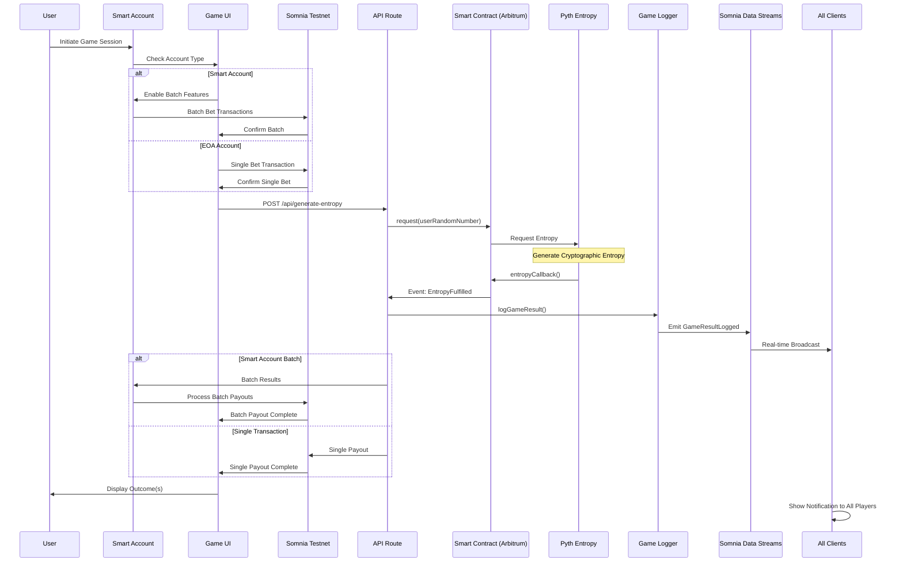

## 🏗️ Smart Contract Deployment Flow

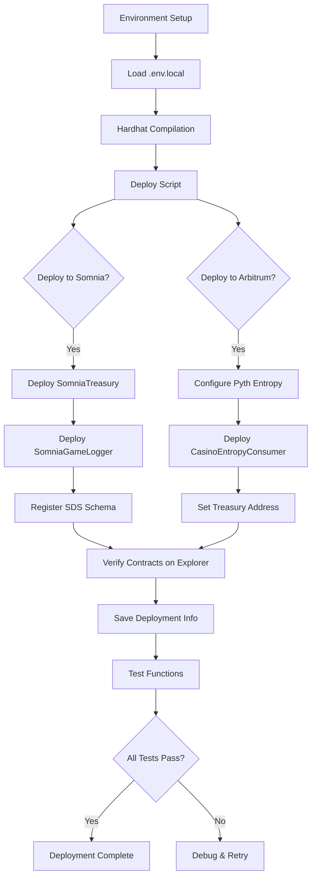

## 🎯 Game-Specific Flows

### Mines Game Flow
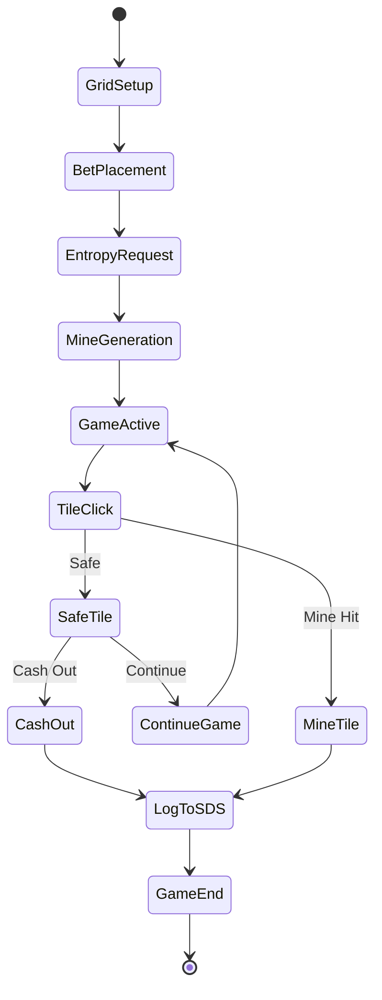

### Plinko Game Flow
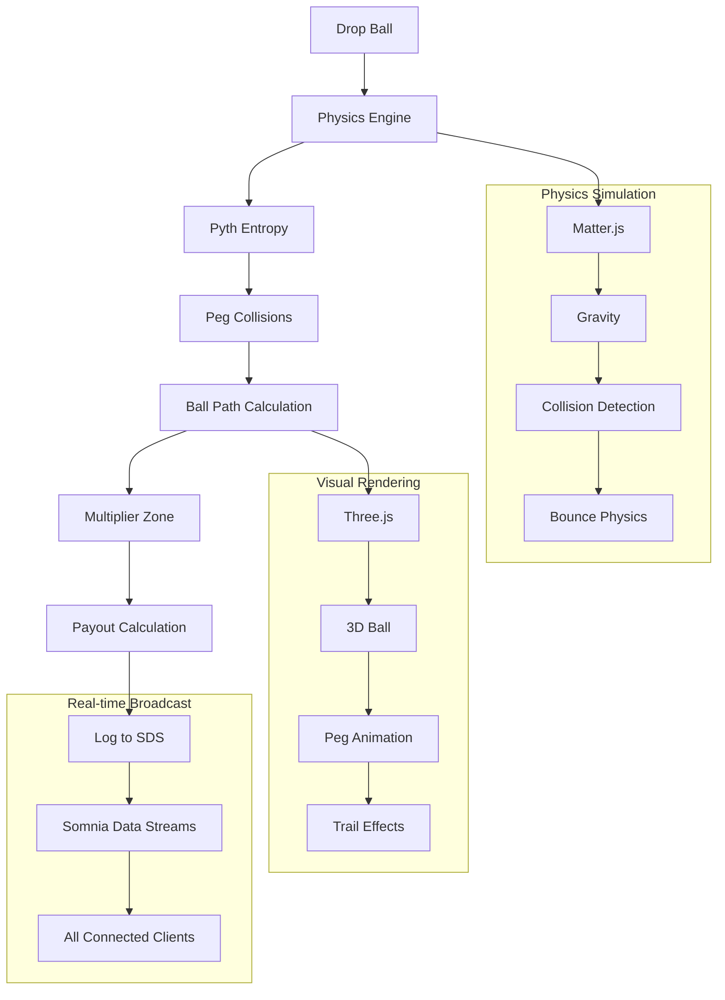

### Roulette Game Flow
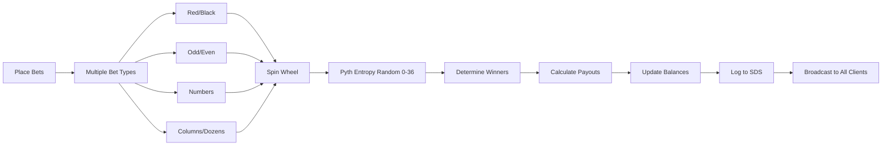

## 🔐 Security & Access Control

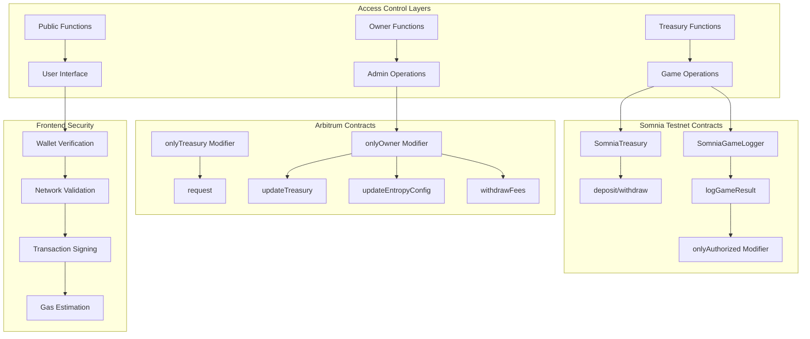

## 📊 Data Flow Architecture

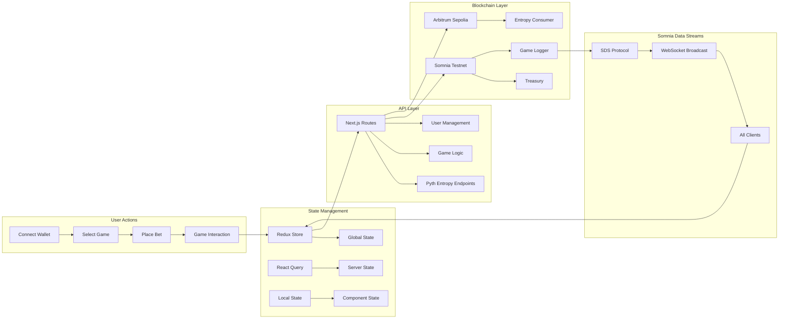

## 🔄 Request-Response Cycle with Data Streams

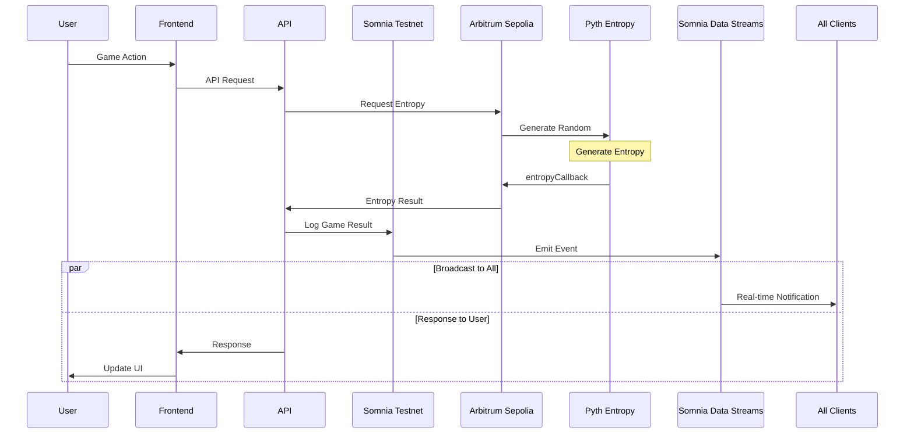

## 🔧 Development Workflow

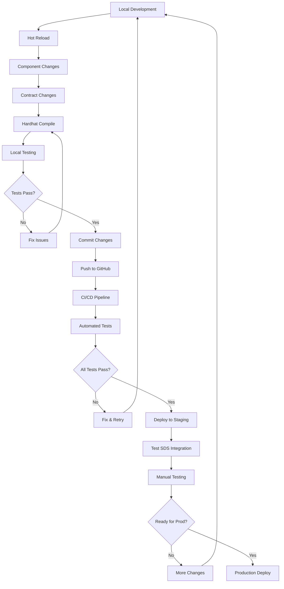

## 📈 Performance Monitoring

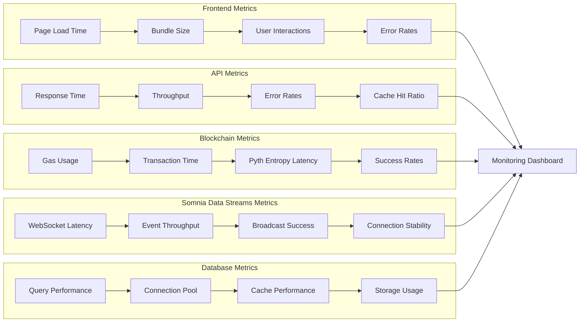

## 🔮 Somnia Data Streams Service Architecture

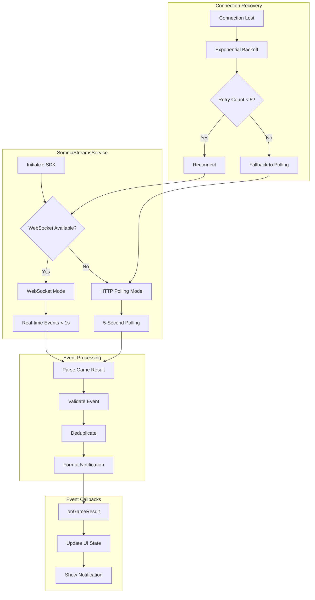

## 🎯 User Journey Flow

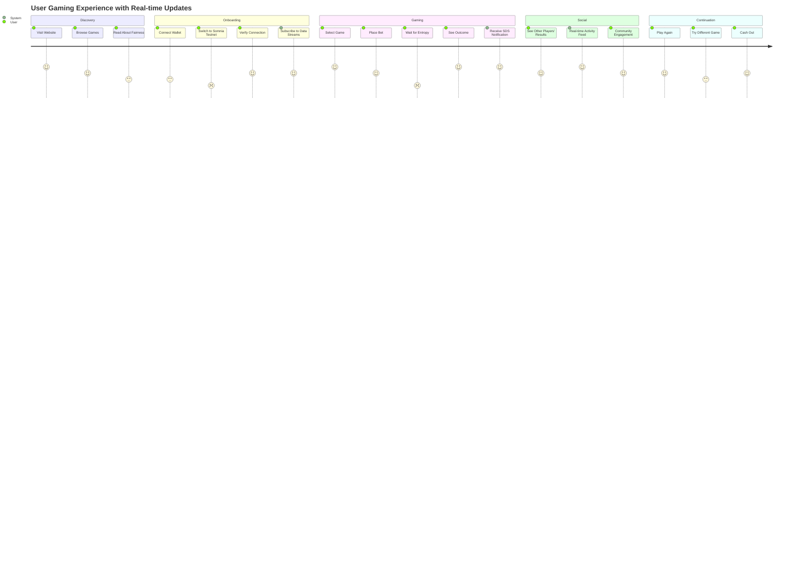

## 🎯 Smart Account Gaming Benefits

```mermaid
graph TB
    subgraph Traditional["Traditional EOA Gaming"]
        EOA[EOA Account] --> ST[Single Transactions]
        ST --> MF[Manual Confirmations]
        MF --> HG[Higher Gas Costs]
        HG --> SG[Slower Gaming]
    end
    
    subgraph SmartAccount["Smart Account Gaming"]
        SA[Smart Account] --> BT[Batch Transactions]
        SA --> SP[Sponsored Transactions]
        SA --> SK[Session Keys]
        SA --> SR[Social Recovery]
        
        BT --> MB[Multi-Bet in One TX]
        SP --> GL[Gasless Gaming]
        SK --> AP[Auto-Play Sessions]
        SR --> AS[Account Security]
    end
    
    subgraph CasinoGames["Casino Game Benefits"]
        MB --> PL[Plinko: Multi-Ball Drop]
        MB --> RT[Roulette: Multi-Number Bets]
        MB --> WH[Wheel: Continuous Play]
        MB --> MN[Mines: Pattern Betting]
        
        GL --> FP[Free Play Mode]
        AP --> ST_AUTO[Strategy Automation]
        AS --> RF[Risk-Free Recovery]
    end
    
    subgraph UserExperience["Enhanced UX"]
        PL --> FG[Faster Gaming]
        RT --> LG[Lower Costs]
        WH --> BG[Better Strategies]
        MN --> EG[Enhanced Security]
        
        FG --> HS[Higher Satisfaction]
        LG --> HS
        BG --> HS
        EG --> HS
    end
```

## 🔄 Smart Account Transaction Flow with SDS

```mermaid
sequenceDiagram
    participant U as User
    participant UI as Casino UI
    participant SA as Smart Account
    participant ST as Somnia Testnet
    participant GL as Game Logger
    participant SDS as Somnia Data Streams
    participant AS as Arbitrum Sepolia
    participant PE as Pyth Entropy
    participant AC as All Clients
    
    Note over U,AC: Smart Account Batch Gaming Session
    
    U->>UI: Select Multiple Games
    UI->>SA: Prepare Batch Transaction
    
    rect rgb(200, 255, 200)
        Note over SA,ST: Batch Transaction on Somnia Testnet
        SA->>ST: Batch Bet Transaction
        ST->>SA: Confirm All Bets
    end
    
    rect rgb(200, 200, 255)
        Note over AS,PE: Entropy Generation on Arbitrum
        UI->>AS: Request Entropy for All Games
        AS->>PE: Generate Multiple Random Numbers
        PE->>AS: Return Entropy Proofs
        AS->>UI: All Game Results
    end
    
    rect rgb(255, 255, 200)
        Note over GL,SDS: Real-time Broadcast via SDS
        UI->>GL: Log All Game Results
        GL->>SDS: Emit GameResultLogged Events
        SDS->>AC: Broadcast to All Connected Clients
    end
    
    rect rgb(255, 200, 200)
        Note over SA,ST: Batch Payout on Somnia Testnet
        UI->>SA: Process Batch Payouts
        SA->>ST: Batch Payout Transaction
        ST->>SA: Confirm All Payouts
    end
    
    SA->>UI: Update All Game States
    UI->>U: Display All Results
    AC->>AC: Show Notifications to All Players
    
    Note over U,AC: Single transaction for multiple games with real-time updates!
```

## 📊 Performance Comparison: EOA vs Smart Account

```mermaid
graph LR
    subgraph Metrics["Performance Metrics"]
        subgraph EOA_Perf["EOA Performance"]
            E1[1 Game = 1 TX]
            E2[Manual Confirmations]
            E3[Higher Gas per Game]
            E4[Slower UX]
        end
        
        subgraph SA_Perf["Smart Account Performance"]
            S1[5 Games = 1 TX]
            S2[Batch Confirmations]
            S3[Optimized Gas]
            S4[Faster UX]
        end
    end
    
    subgraph Comparison["Direct Comparison"]
        subgraph Time["Time Efficiency"]
            T1[EOA: 5 minutes for 5 games]
            T2[Smart Account: 1 minute for 5 games]
        end
        
        subgraph Cost["Cost Efficiency"]
            C1[EOA: 5x Gas Costs]
            C2[Smart Account: 1.2x Gas Cost]
        end
        
        subgraph UX["User Experience"]
            U1[EOA: 5 Confirmations]
            U2[Smart Account: 1 Confirmation]
        end
    end
    
    E1 --> T1
    S1 --> T2
    E3 --> C1
    S3 --> C2
    E2 --> U1
    S2 --> U2
```

## 📡 Complete Data Streams Integration

```mermaid
graph TB
    subgraph Frontend["Frontend Layer"]
        A[useSomniaStreams Hook] --> B[GlobalNotificationSystem]
        B --> C[Toast Notifications]
        B --> D[Activity Feed]
    end
    
    subgraph Service["SomniaStreamsService"]
        E[SDK Initialization] --> F[Schema Registration]
        F --> G[Event Subscription]
        G --> H[Event Processing]
    end
    
    subgraph Config["Configuration"]
        I[Schema ID: apt-casino-game-result-logged]
        J[Contract: SomniaGameLogger]
        K[Protocol: 0x6AB397FF...048Fc]
    end
    
    subgraph EventTypes["Event Types"]
        L[ROULETTE] --> M[Game Result Event]
        N[MINES] --> M
        O[PLINKO] --> M
        P[WHEEL] --> M
    end
    
    subgraph Delivery["Event Delivery"]
        Q[WebSocket Primary] --> R{Connected?}
        R -->|Yes| S[Real-time < 1s]
        R -->|No| T[HTTP Polling 5s]
    end
    
    A --> E
    H --> B
    I --> G
    J --> G
    M --> H
    S --> C
    T --> C
```

This comprehensive set of Mermaid diagrams provides visual representations of all major architectural components and flows in the APT Casino Somnia application, featuring:

- **Somnia Testnet** - Main gaming network (Chain ID: 50312)
- **Somnia Data Streams** - Real-time event broadcasting
- **Pyth Entropy** - Cryptographically secure randomness on Arbitrum Sepolia
- **Smart Account Integration** - Enhanced gaming with batch transactions
- **Real-time Notifications** - Live activity feed for all connected players
