# APT Casino - Somnia Testnet 🎰

A production-ready decentralized casino platform built on Somnia Testnet featuring:
- **Somnia Data Streams Integration** - Real-time game result notifications across all connected clients
- **Pyth Entropy** - Provably fair gaming with cryptographically secure randomness
- **MetaMask Smart Accounts** - Enhanced wallet experience with batch transactions
- **Multi-Network Architecture** - Somnia Testnet for gaming, Arbitrum Sepolia for entropy

## 🎮 The Story Behind APT Casino

A few days ago, I was exploring transactions on Etherscan when I saw an advertisement for a popular centralized casino platform offering a 200% bonus on first deposits. I deposited 120 USDT and received 360 USDT in total balance in their custodial wallet.

When I started playing, I discovered I could only bet $1 per game and couldn't increase the amount. After contacting customer support, I learned I had been trapped by hidden "wager limits" tied to the bonus scheme. To withdraw my original deposit, I would need to play $12,300 worth of games!

In a desperate attempt to recover my funds, I played different games all night—roulette, mines, spin wheel—and lost everything.

This frustrating experience inspired APT Casino: a combination of GameFi, AI, and DeFi where users can enjoy casino games in a safe, secure, and transparent environment that doesn't scam its users.

## 🎯 The Problem

The traditional online gambling industry suffers from several issues:

- **Unfair Game Outcomes**: 99% of platforms manipulate game results, leading to unfair play
- **High Fees**: Exorbitant charges for deposits, withdrawals, and gameplay
- **Restrictive Withdrawal Policies**: Conditions that prevent users from accessing their funds
- **Misleading Bonus Schemes**: Trapping users with unrealistic wagering requirements
- **Lack of True Asset Ownership**: Centralized control over user funds
- **User Adoption Barriers**: Complexity of using wallets creates friction for web2 users
- **No Social Layer**: Lack of live streaming, community chat, and collaborative experiences

## 💡 Our Solution

APT Casino addresses these problems by offering:

- **Provably Fair Gaming**: Powered by Pyth Entropy


- **Multiple Games**: Wheel, Roulette, Plinko, and Mines with verifiable outcomes
- **MetaMask Smart Accounts**: Enhanced wallet experience with batch transactions
- **STT Token**: Native currency for Somnia Testnet
- **Flexible Withdrawal**: Unrestricted access to funds
- **Transparent Bonuses**: Clear terms without hidden traps
- **True Asset Ownership**: Decentralized asset management
- **Live Streaming Integration**: Built with Livepeer, enabling real-time game streams and tournaments
- **On-Chain Chat**: Supabase + Socket.IO with wallet-signed messages for verifiable player communication
- **Gasless Gaming Experience**: Treasury-sponsored transactions for seamless web2-like experience

## 🌟 Key Features

### 1. Smart Account Integration

- **Batch Transactions**: Multiple bets in one transaction
- **Delegated Gaming**: Authorize strategies to play on your behalf
- **Lower Gas Costs**: Optimized for frequent players
- **Enhanced Security**: Smart contract-based accounts

### 2. Provably Fair Gaming


- **Pyth Entropy**: Cryptographically secure randomness
- **On-Chain Verification**: All game outcomes verifiable
- **Transparent Mechanics**: Open-source game logic

### 3. Multi-Chain Architecture

- **Gaming Network**: Somnia Testnet (Chain ID: 50312)
- **Entropy Network**: Arbitrum Sepolia (Chain ID: 421614)

### 4. Game Selection

- **Roulette**: European roulette with Smart Account batch betting
- **Mines**: Strategic mine-sweeping with delegated pattern betting
- **Plinko**: Physics-based ball drop with auto-betting features
- **Wheel**: Classic spinning wheel with multiple risk levels

### 5. Social Features

- **Live Streaming**: Integrated with Livepeer for real-time game streams and tournaments
- **On-Chain Chat**: Real-time communication with wallet-signed messages
- **Player Profiles**: NFT-based profiles with gaming history and achievements
- **Community Events**: Tournaments and collaborative gaming experiences

### 6. Web2 User Experience

- **Gasless Transactions**: Treasury-sponsored transactions eliminate gas fees
- **Seamless Onboarding**: Simplified wallet experience for web2 users
- **Familiar Interface**: Web2-like experience with web3 benefits

## 🚀 Getting Started

1. **Connect Wallet**: Connect your MetaMask wallet to Somnia Testnet
2. **Get Tokens**: Get STT tokens from the Somnia Testnet faucet
3. **Deposit**: Deposit STT to your treasury balance
4. **Play**: Start playing provably fair games!

### Network Configuration

Add Somnia Testnet to MetaMask:
- **Network Name**: Somnia Testnet
- **RPC URL**: `https://dream-rpc.somnia.network`
- **Chain ID**: `50312`
- **Currency Symbol**: `STT`
- **Block Explorer**: `https://shannon-explorer.somnia.network`

### Quick Setup

```bash
# Clone the repository
git clone <repository-url>
cd apt-casino

# Install dependencies
npm install

# Set up environment variables
cp .env.example .env
# Edit .env with your configuration

# Run development server
npm run dev
```

Visit `http://localhost:3000` to see the application.

## 🔷 Smart Account Features

APT Casino leverages MetaMask Smart Accounts for an enhanced gaming experience:

### Delegation Benefits:
- **Auto-Betting Strategies**: Delegate betting permissions to strategy contracts
- **Batch Gaming Sessions**: Play multiple games in a single transaction
- **Session-Based Gaming**: Set time-limited permissions for continuous play
- **Gasless Gaming**: Sponsored transactions for smoother experience

### Usage:
```javascript
// Create a delegation for auto-betting
const createAutoBetDelegation = async (maxBet, timeLimit, gameTypes) => {
  return delegationRegistry.createDelegation({
    delegatee: strategyContract,
    constraints: {
      maxAmount: maxBet,
      validUntil: timeLimit,
      allowedGames: gameTypes
    }
  });
};

// Execute batch bets through delegation
const executeBatchBets = async (bets) => {
  return delegationRegistry.executeDelegatedTransactions({
    delegationId,
    transactions: bets.map(bet => ({
      to: bet.gameContract,
      data: bet.data,
      value: bet.amount
    }))
  });
};
```

## 🏗 System Architecture Overview

```mermaid
graph TB
    subgraph Frontend["Frontend Layer"]
        A[Next.js App] --> B[React Components]
        B --> C[Three.js Games]
        B --> D[Material-UI]
        B --> E[RainbowKit + MetaMask Smart Accounts]
        E --> SA[Smart Account Detection]
        B --> LS[Livepeer Streaming]
        B --> CC[Community Chat]
    end
    
    subgraph State["State Management"]
        F[Redux Store] --> G[React Query]
        G --> H[Local State]
        H --> SAH[Smart Account Hook]
    end
    
    subgraph API["API Layer"]
        I[Next.js API Routes] --> J[Pyth Entropy Endpoints]
        I --> K[Deposit/Withdraw MON]
        I --> L[Game Logic]
        I --> SAA[Smart Account API]
        I --> SC[Socket.IO Chat]
        I --> LP[Livepeer API]
    end
    
    subgraph Gaming["Gaming Network - Somnia Testnet"]
        MT[Somnia Testnet] --> STT[STT Token]
        MT --> DEP[Deposits/Withdrawals]
        MT --> SA_BATCH[Batch Transactions]
        MT --> GAS[Gasless Transactions]
    end
    
    subgraph Entropy["Entropy Network - Arbitrum Sepolia"]
        AS[Arbitrum Sepolia] --> N[CasinoEntropyConsumer]
        N --> O[Pyth Entropy]
        O --> P[Pyth Network]
    end
    
    subgraph Data["Data Layer"]
        Q[PostgreSQL] --> R[User Data]
        Q --> CH[Chat History]
        Q --> PF[Player Profiles]
        S[Redis Cache] --> T[Session Data]
        S --> U[Game State]
        S --> SAC[Smart Account Cache]
        S --> LV[Live Streams]
    end
    
    subgraph Social["Social Layer"]
        LP[Livepeer] --> ST[Streaming]
        SB[Supabase] --> RT[Real-time Chat]
        SIO[Socket.IO] --> MS[Message Signing]
    end
    
    A --> F
    B --> I
    I --> MT
    I --> AS
    I --> Q
    I --> S
    N --> I
    SA --> SAA
    CC --> SC
    LS --> LP
    SC --> SB
    SC --> SIO
    LP --> ST
```

## 🔗 Wallet Connection & Smart Account Flow

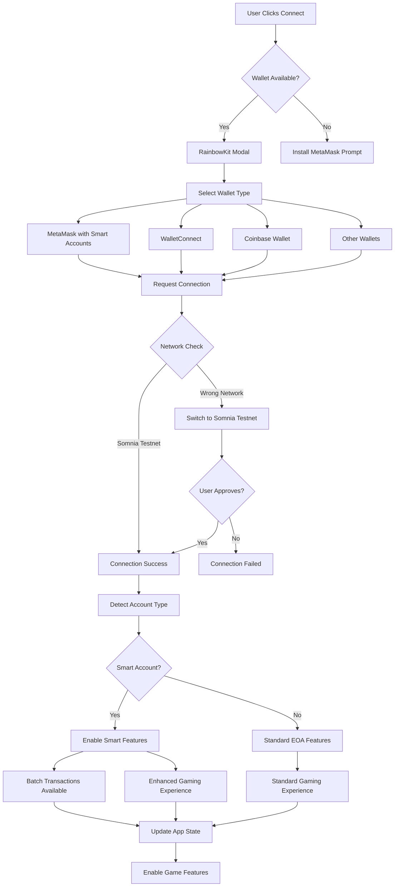

## 🔷 Smart Account Detection & Features

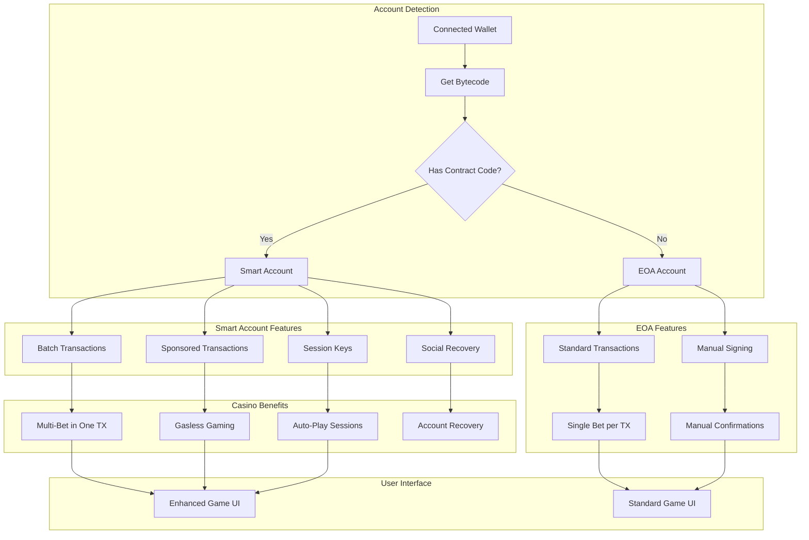

## 🌐 Multi-Network Architecture (Somnia Testnet + Arbitrum)

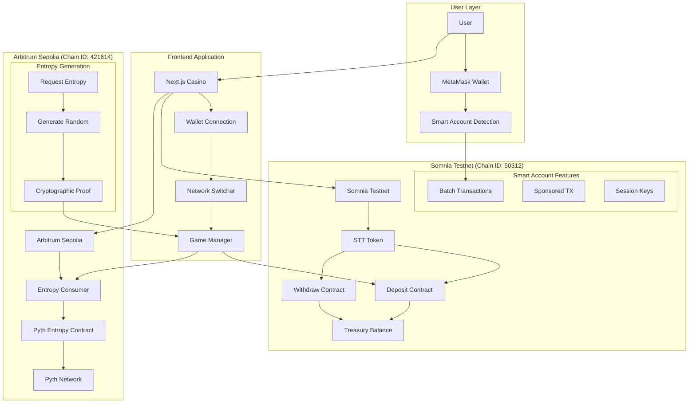

## 🎲 Pyth Entropy Integration Architecture

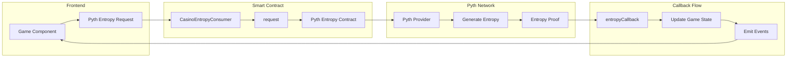

## 🎮 Game Execution Flow (Smart Account Enhanced)

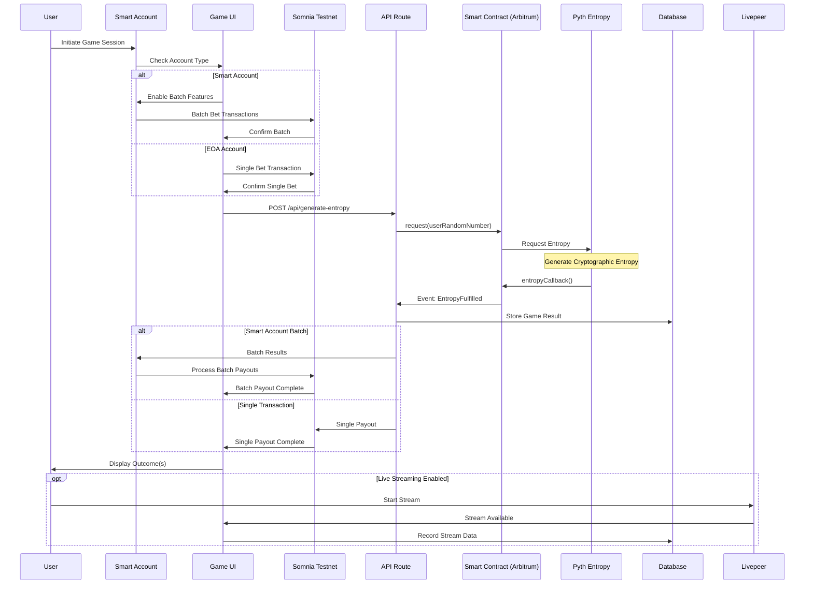

## 🎯 Smart Account Gaming Benefits

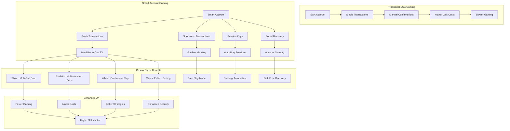

## 🔄 Smart Account Transaction Flow

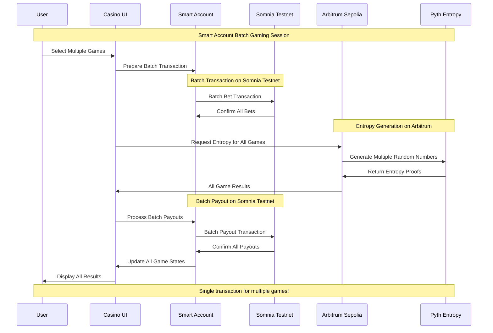


## 🎯 Game Integration with Smart Accounts & Pyth Entropy

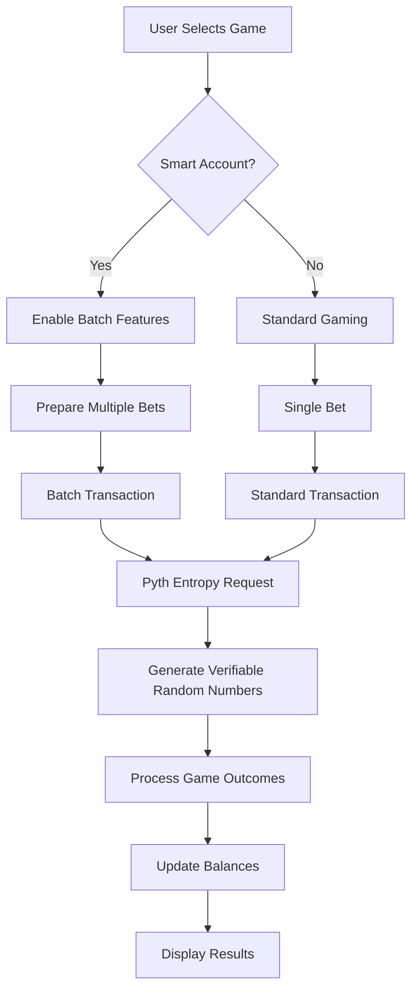

## 🔮 Future Roadmap

- **Mainnet Launch**: Deploying on mainnet for real-world use
- **Additional Games**: Expanding the game selection
- **Enhanced DeFi Features**: Staking, farming, yield strategies
- **Developer Platform**: Allowing third-party game development
- **Advanced Social Features**: Enhanced live streaming and chat capabilities
- **ROI Share Links**: Shareable proof-links for withdrawals that render dynamic cards on social platforms
- **Expanded Smart Account Features**: More delegation options
- **Tournament System**: Competitive gaming with leaderboards and prizes

## 📡 Somnia Data Streams Integration 

**This project demonstrates real-time gaming using Somnia Data Streams SDK** - turning on-chain game results into live, reactive streams that update all connected clients instantly.

### 🎯 How SDS is Used

APT Casino leverages **Somnia Data Streams SDK** to create a real-time, reactive gaming experience:

- **Real-time Notifications**: Instant updates when ANY player completes a game (< 1 second latency)
- **Global Activity Feed**: All connected browsers see live gaming activity simultaneously
- **WebSocket Subscriptions**: Efficient event streaming with automatic reconnection
- **Multi-Client Broadcasting**: One game completion → all clients notified instantly
- **On-Chain Verification**: All notifications linked to verifiable blockchain transactions

### 🏗️ Architecture

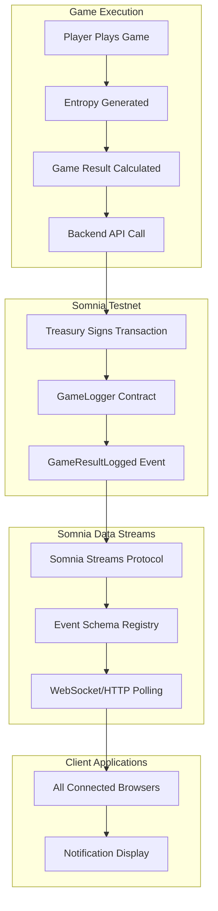

### 🔄 Event Flow

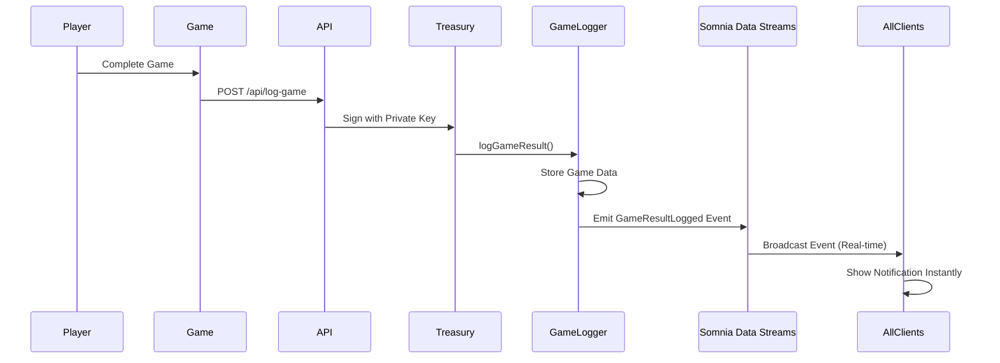

### 📋 Event Schema Registration

**Schema ID:** `apt-casino-game-result-logged`

**Schema Definition:**
```javascript
{
  schemaId: 'apt-casino-game-result-logged',
  params: [
    { name: 'logId', type: 'bytes32', indexed: true },
    { name: 'player', type: 'address', indexed: true },
    { name: 'gameType', type: 'uint8', indexed: false },
    { name: 'betAmount', type: 'uint256', indexed: false },
    { name: 'payout', type: 'uint256', indexed: false },
    { name: 'entropyRequestId', type: 'bytes32', indexed: false },
    { name: 'entropyTxHash', type: 'string', indexed: false },
    { name: 'timestamp', type: 'uint256', indexed: false }
  ]
}
```

**Registration:**
```bash
node scripts/register-game-result-schema.js
```

### 💻 SDK Implementation

**Service Architecture:**
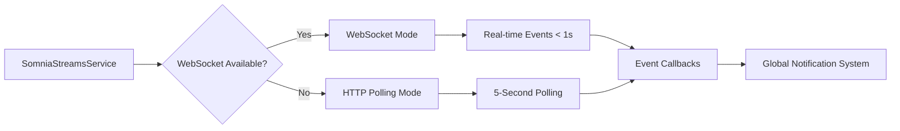

**Key Implementation Files:**
- `src/services/SomniaStreamsService.js` - Main SDS service implementation
- `src/hooks/useSomniaStreams.js` - React hook wrapper
- `src/components/GlobalNotificationSystem.jsx` - UI integration
- `src/config/somniaStreams.js` - Configuration
- `somnia-streams/` - Somnia Streams SDK package

### 🔌 SDK Usage Example

**1. Initialize SDK:**
```javascript
import { SDK } from '../../somnia-streams/dist/index.js';
import { createPublicClient, webSocket } from 'viem';

const publicClient = createPublicClient({
  chain: somniaTestnetConfig,
  transport: webSocket('wss://dream-rpc.somnia.network')
});

const sdk = new SDK({ public: publicClient });
```

**2. Subscribe to Events:**
```javascript
const subscription = await sdk.streams.subscribe({
  somniaStreamsEventId: 'apt-casino-game-result-logged',
  ethCalls: [],
  context: '',
  onlyPushChanges: false,
  onData: (data) => {
    // Handle real-time event data
    const event = parseGameResultEvent(data);
    notifyAllClients(event);
  },
  onError: (error) => {
    // Handle errors with auto-reconnection
  }
});
```

**3. React Hook Usage:**
```javascript
import { useSomniaStreams } from '@/hooks/useSomniaStreams';

function GameComponent() {
  const { isConnected, error } = useSomniaStreams({
    onGameResult: (event) => {
      // Handle new game result in real-time
      console.log('New game:', event);
      showNotification(event);
    },
    onError: (error) => {
      console.error('Stream error:', error);
    },
    autoConnect: true
  });
  
  return (
    <div>
      {isConnected ? '✅ Connected to Data Streams' : '⏳ Connecting...'}
    </div>
  );
}
```

### ⚡ Real-Time Features

**1. Global Notifications:**
- All connected users see game results instantly
- No polling required - event-driven updates
- WebSocket-based for minimal latency (< 1 second)

**2. Connection Management:**
- Auto-reconnection with exponential backoff (5 attempts)
- Fallback to HTTP polling if WebSocket fails
- Connection status indicators in UI

**3. Event Processing:**
- Event deduplication using unique IDs
- Validation of event structure
- Error handling and recovery

**4. Notification Display:**
- Maximum 5 concurrent notifications
- 8-second auto-dismiss
- Win/loss color coding
- Game type icons
- Profit/loss calculation

### 📊 Performance Characteristics

**WebSocket Mode:**
- **Latency:** < 1 second
- **Bandwidth:** Minimal (event-driven)
- **Reliability:** High (with auto-reconnection)

**HTTP Polling Mode (Fallback):**
- **Latency:** 0-5 seconds
- **Bandwidth:** Regular polling requests
- **Reliability:** High (no connection state)

### 🧪 Testing SDS Integration

```bash
# Test Data Streams service
node scripts/test-somnia-streams.js

# Verify schema registration
node scripts/verify-schema-registration.js

# Test WebSocket diagnostics
node scripts/diagnose-websocket.js
```

### 🎮 Real-Time Use Case

**Problem Solved:**
Traditional casinos have isolated gaming experiences - players don't see what others are doing. This creates a disconnected, non-social environment.

**SDS Solution:**
- **Live Activity Feed**: All players see game results in real-time
- **Social Engagement**: Shared experience creates community
- **Instant Updates**: No page refresh needed
- **Multi-Client Sync**: All browsers stay synchronized

**Example Flow:**
1. Player A completes Roulette game
2. Event emitted on Somnia Testnet (< 1 second)
3. Somnia Data Streams captures event
4. All connected clients (Player B, C, D...) receive notification instantly
5. UI updates across all browsers simultaneously
6. Players see live casino activity in real-time

## 🎮 Game Logger

All game results are permanently logged on Somnia Testnet blockchain:

### Features
- **Immutable Records**: All game outcomes stored on-chain
- **Verifiable History**: Transaction links for every game
- **Dual-Network Architecture**: Game logs on Somnia, entropy on Arbitrum
- **Automatic Logging**: Non-blocking, fire-and-forget logging

### Smart Contract

```solidity
contract SomniaGameLogger {
  function logGameResult(
    string memory gameType,
    uint256 betAmount,
    bytes memory resultData,
    uint256 payout,
    bytes32 entropyRequestId
  ) external returns (bytes32 logId);
}
```

### Integration

```javascript
import { useSomniaGameLogger } from '@/hooks/useSomniaGameLogger';

const { logGame, getExplorerUrl } = useSomniaGameLogger();

// After game completes
const txHash = await logGame({
  gameType: 'ROULETTE',
  betAmount: '1000000000000000000',
  result: gameResult,
  payout: '2000000000000000000',
  entropyProof: entropyResult.entropyProof
});

console.log('View on explorer:', getExplorerUrl(txHash));
```

### Integration Example

```javascript
import { useSomniaGameLogger } from '@/hooks/useSomniaGameLogger';

const { logGame, getExplorerUrl } = useSomniaGameLogger();

// After game completes
const txHash = await logGame({
  gameType: 'ROULETTE',
  betAmount: '1000000000000000000',
  result: gameResult,
  payout: '2000000000000000000',
  entropyProof: entropyResult.entropyProof
});

console.log('View on explorer:', getExplorerUrl(txHash));
```

## 🚀 Deployment

### Prerequisites

- Node.js 18+ and npm
- MetaMask wallet with STT tokens
- Somnia Testnet RPC access

### Environment Variables

Create a `.env` file with the following:

```env
# Somnia Testnet Configuration
NEXT_PUBLIC_SOMNIA_RPC_URL=https://dream-rpc.somnia.network
NEXT_PUBLIC_SOMNIA_CHAIN_ID=50312
NEXT_PUBLIC_SOMNIA_EXPLORER_URL=https://shannon-explorer.somnia.network

# Arbitrum Sepolia (for Pyth Entropy)
NEXT_PUBLIC_ARBITRUM_SEPOLIA_RPC_URL=https://sepolia-rollup.arbitrum.io/rpc
NEXT_PUBLIC_ARBITRUM_SEPOLIA_CHAIN_ID=421614

# Contract Addresses (Somnia Testnet)
NEXT_PUBLIC_SOMNIA_TREASURY_ADDRESS=<your-treasury-address>
NEXT_PUBLIC_SOMNIA_GAME_LOGGER_ADDRESS=<your-game-logger-address>

# Contract Addresses (Arbitrum Sepolia)
NEXT_PUBLIC_PYTH_ENTROPY_ADDRESS=<pyth-entropy-address>
NEXT_PUBLIC_CASINO_ENTROPY_CONSUMER_ADDRESS=<your-entropy-consumer-address>

# Somnia Data Streams
NEXT_PUBLIC_SOMNIA_STREAMS_PROTOCOL_ADDRESS=0x6AB397FF662e42312c003175DCD76EfF69D048Fc
NEXT_PUBLIC_GAME_RESULT_EVENT_SCHEMA_ID=apt-casino-game-result-logged

# Private Keys (for deployment only, never commit!)
DEPLOYER_PRIVATE_KEY=<your-private-key>
```

### Smart Contract Deployment

```bash
# Deploy contracts to Somnia Testnet
npx hardhat run scripts/deploy-somnia-contracts.js --network somniaTestnet

# Verify deployment
node scripts/test-somnia-deployment.js
```

### Frontend Deployment

```bash
# Build the application
npm run build

# Deploy to Vercel
vercel deploy

# Or deploy to other platforms
npm run start
```

### Post-Deployment Steps

1. **Register Data Streams Schema**
   ```bash
   node scripts/register-game-result-schema.js
   ```

2. **Verify Schema Registration**
   ```bash
   node scripts/verify-schema-registration.js
   ```

3. **Test Game Logger**
   ```bash
   node scripts/verify-game-logger.js
   ```

4. **Test Data Streams**
   ```bash
   node scripts/test-somnia-streams.js
   ```

5. **Test All Games**
   ```bash
   node scripts/test-entropy-all-games.js
   ```

For detailed deployment guide, see [Deployment Summary](./deployments/SOMNIA_DEPLOYMENT_SUMMARY.md).

**How SDS is Used:**
- Real-time game result notifications using SDS SDK
- WebSocket subscriptions for instant updates
- Global activity feed across all connected clients
- Event-driven architecture with automatic reconnection

**Key Implementation:**
- **Service:** `src/services/SomniaStreamsService.js`
- **Hook:** `src/hooks/useSomniaStreams.js`
- **Component:** `src/components/GlobalNotificationSystem.jsx`
- **Schema ID:** `apt-casino-game-result-logged`

**Real-Time UX:**
- < 1 second latency for notifications
- Multi-client synchronization
- Automatic fallback to HTTP polling
- Connection status indicators

**Somnia Integration:**
- ✅ Deployed on Somnia Testnet (Chain ID: 50312)
- ✅ Smart contracts live and verified
- ✅ Events emitting correctly
- ✅ All transactions verifiable on explorer

**Potential Impact:**
- Production-ready casino platform
- Perfect showcase for SDS real-time gaming use case
- Scalable architecture for thousands of concurrent players
- Well-documented for ecosystem learning

## 📚 Additional Documentation

### Service Documentation
- [Somnia Streams Service](./src/services/SOMNIA_STREAMS_SERVICE_README.md) - Detailed service implementation
- [Game Logger Service](./src/services/GAME_LOGGER_README.md) - On-chain logging details

### Deployment Reports
- [Somnia Deployment Summary](./deployments/SOMNIA_DEPLOYMENT_SUMMARY.md) - Deployment artifacts

## 🔧 Development

### Running Tests

```bash
# Run all tests
npm test

# Run specific test suite
npm test -- SomniaGameLogger
npm test -- SomniaStreamsService

# Run with coverage
npm test -- --coverage
```

### Verification Scripts

```bash
# Verify Pyth Entropy (Arbitrum Sepolia)
node scripts/verify-pyth-entropy.js

# Verify Game Logger (Somnia Testnet)
node scripts/verify-game-logger.js

# Verify Data Streams
node scripts/test-somnia-streams.js

# Verify all games
node scripts/test-entropy-all-games.js

# Verify API routes
node scripts/verify-api-routes.js

# Verify game history
node scripts/verify-game-history-service.js
```

### Project Structure

```
apt-casino/
├── contracts/              # Smart contracts
│   ├── SomniaTreasury.sol
│   └── SomniaGameLogger.sol
├── src/
│   ├── app/               # Next.js pages
│   ├── components/        # React components
│   ├── config/            # Network and contract configs
│   ├── hooks/             # Custom React hooks
│   ├── services/          # Business logic services
│   └── utils/             # Utility functions
├── scripts/               # Deployment and verification scripts
├── docs/                  # Documentation
├── deployments/           # Deployment artifacts
└── somnia-streams/        # Somnia Streams SDK
```

## 🔗 Links & Resources

### Live Application
- **Website Link**: [https://apt-casino-somnia-testnet.vercel.app](https://apt-casino-somnia-testnet.vercel.app)
- **Live Demo**: [https://youtu.be/F-6Gsy1Qi1s](https://youtu.be/F-6Gsy1Qi1s)
- **Pitch Deck**: [https://www.figma.com/deck/VKHErF5fQr9JVOvjn9VWg3/APT-Casino-Somnia Testnet?node-id=1-1812&p=f&t=ayEzRDoZZrC2bNfR-1&scaling=min-zoom&content-scaling=fixed&page-id=0%3A1](https://www.figma.com/deck/VKHErF5fQr9JVOvjn9VWg3/APT-Casino-Somnia Testnet?node-id=1-1812&p=f&t=ayEzRDoZZrC2bNfR-1&scaling=min-zoom&content-scaling=fixed&page-id=0%3A1)

### Blockchain Explorers
- **Somnia Testnet Explorer**: [https://shannon-explorer.somnia.network](https://shannon-explorer.somnia.network)
- **Arbitrum Sepolia Explorer**: [https://sepolia.arbiscan.io](https://sepolia.arbiscan.io)
