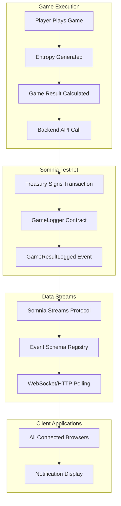
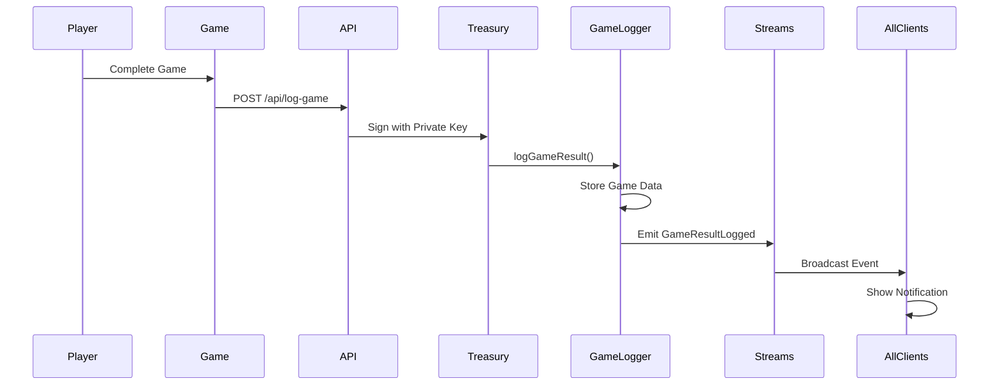
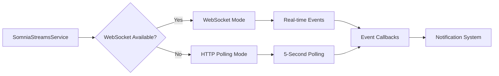
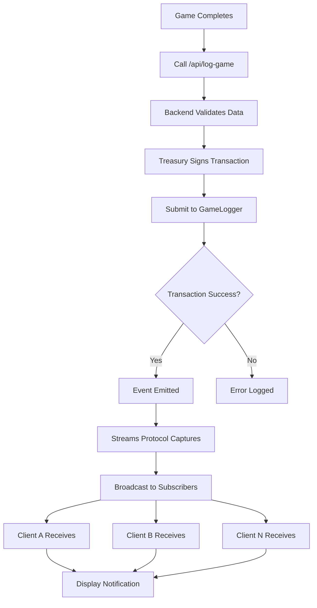
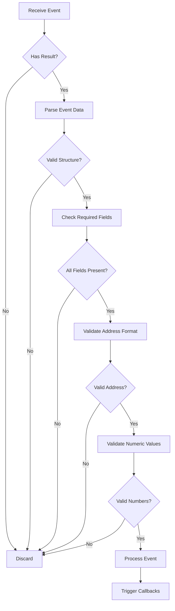
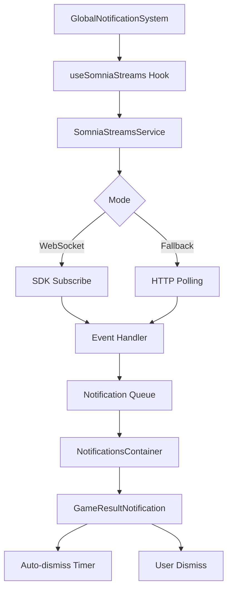
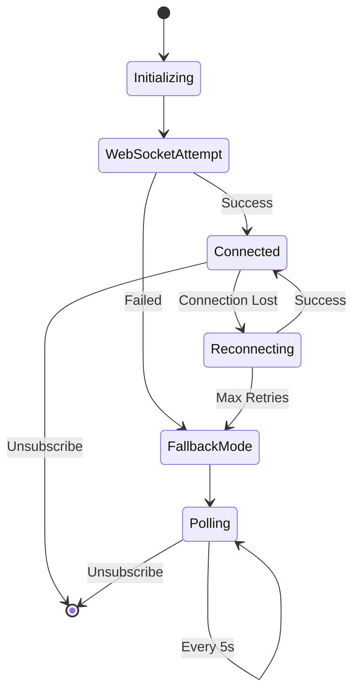
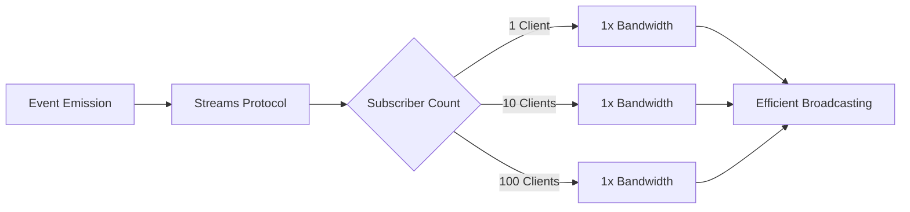

# Somnia Data Streams Integration

## Overview

This document describes how APT Casino integrates with Somnia Data Streams to provide real-time game result notifications across all connected clients.

## Architecture

### System Components



### Event Flow



## Implementation Details

### 1. Event Schema Registration

Before using Data Streams, the event schema must be registered on Somnia Testnet.

**Schema Definition:**
```javascript
{
  schemaId: 'apt-casino-game-result-logged',
  params: [
    { name: 'player', type: 'address', indexed: true },
    { name: 'gameType', type: 'string', indexed: false },
    { name: 'betAmount', type: 'uint256', indexed: false },
    { name: 'payout', type: 'uint256', indexed: false },
    { name: 'entropyRequestId', type: 'bytes32', indexed: false },
    { name: 'timestamp', type: 'uint256', indexed: false }
  ]
}
```

**Registration Process:**
```bash
node scripts/register-game-result-schema.js
```

This script:
1. Connects to Somnia Testnet
2. Registers the event schema with Streams Protocol
3. Returns a unique schema ID for subscriptions

### 2. Service Architecture



**Primary Service (WebSocket):**
- Uses Somnia Streams SDK
- Subscribes to `GameResultLogged` events
- Receives real-time updates via WebSocket

**Fallback Service (HTTP Polling):**
- Polls blockchain every 5 seconds
- Queries new blocks for events
- Provides same functionality when WebSocket unavailable

### 3. Client Integration

**Hook Usage:**
```javascript
import { useSomniaStreams } from '@/hooks/useSomniaStreams';

function GameComponent() {
  const { isConnected, error } = useSomniaStreams({
    onGameResult: (event) => {
      // Handle new game result
      console.log('New game:', event);
    },
    onError: (error) => {
      // Handle errors
      console.error('Stream error:', error);
    },
    autoConnect: true
  });
  
  return (
    <div>
      {isConnected ? 'Connected' : 'Connecting...'}
    </div>
  );
}
```

### 4. Data Flow



## Configuration

### Environment Variables

```env
# Somnia Testnet RPC
NEXT_PUBLIC_SOMNIA_RPC_URL=https://dream-rpc.somnia.network

# Contract Addresses
NEXT_PUBLIC_SOMNIA_GAME_LOGGER_ADDRESS=0x649A1a3cf745d60C98C12f3c404E09bdBb4151db
NEXT_PUBLIC_SOMNIA_STREAMS_ADDRESS=0x6AB397FF662e42312c003175DCD76EfF69D048Fc

# Event Schema
NEXT_PUBLIC_GAME_RESULT_EVENT_SCHEMA_ID=apt-casino-game-result-logged

# Treasury Private Key (Backend Only)
SOMNIA_TESTNET_TREASURY_PRIVATE_KEY=0x...
```

### Service Configuration

```javascript
// src/config/somniaStreams.js
export const STREAMS_SUBSCRIPTION_CONFIG = {
  onlyPushChanges: false,
  reconnect: {
    enabled: true,
    maxAttempts: 5,
    delayMs: 3000,
    backoffMultiplier: 1.5
  }
};
```

## Event Processing

### Event Structure

```javascript
{
  player: '0x742d35Cc6634C0532925a3b844Bc9e7595f0bEb',
  gameType: 'ROULETTE',
  betAmount: '1000000000000000000', // 1 STT in wei
  payout: '3000000000000000000',    // 3 STT in wei
  entropyRequestId: '0x6438207b3d1c6dfc6de108d9d017a02f9ced37879ad53df219d8e6e70b8c2a41',
  timestamp: 1732742400
}
```

### Event Validation



## Notification System

### Component Hierarchy



### Notification Display

**Features:**
- Maximum 5 concurrent notifications
- 8-second auto-dismiss
- Win/loss color coding
- Player address truncation
- Game type icons
- Profit/loss calculation

## Error Handling

### Connection States



### Reconnection Logic

**Exponential Backoff:**
- Attempt 1: 3000ms delay
- Attempt 2: 4500ms delay
- Attempt 3: 6750ms delay
- Attempt 4: 10125ms delay
- Attempt 5: 15187ms delay

After 5 failed attempts, system switches to HTTP polling mode.

## Performance Characteristics

### WebSocket Mode
- **Latency:** < 1 second
- **Bandwidth:** Minimal (event-driven)
- **Reliability:** High (with reconnection)

### HTTP Polling Mode
- **Latency:** 0-5 seconds
- **Bandwidth:** Regular polling requests
- **Reliability:** High (no connection state)

### Resource Usage



## Testing

### Verification Scripts

**1. Schema Registration:**
```bash
node scripts/verify-schema-registration.js
```

**2. Service Functionality:**
```bash
node scripts/test-somnia-streams.js
```

**3. WebSocket Diagnostics:**
```bash
node scripts/diagnose-websocket.js
```

### Manual Testing

1. Open application in multiple browser windows
2. Play a game in one window
3. Verify notification appears in all windows
4. Check console for connection status
5. Verify transaction on block explorer

## Troubleshooting

### Common Issues

**Issue: No notifications appearing**
- Check browser console for connection status
- Verify schema is registered
- Confirm GameLogger contract is emitting events
- Check network connectivity

**Issue: WebSocket connection fails**
- System automatically switches to HTTP polling
- No action required
- Notifications still work with 0-5 second delay

**Issue: Duplicate notifications**
- Service implements deduplication
- Uses event ID: `${blockNumber}-${logIndex}-${eventType}`
- Prevents same event from showing twice

## API Reference

### SomniaStreamsService

**Methods:**
- `initialize(walletClient, gameLoggerAddress)` - Initialize service
- `subscribeToGameResults(onGameResult, onError)` - Subscribe to events
- `unsubscribe()` - Stop subscription
- `reconnect()` - Manual reconnection
- `isSubscribed()` - Check connection status

### useSomniaStreams Hook

**Parameters:**
- `onGameResult` - Callback for new events
- `onError` - Error handler
- `autoConnect` - Auto-connect on mount (default: true)

**Returns:**
- `isInitialized` - SDK initialization status
- `isConnected` - Subscription status
- `subscriptionId` - Current subscription ID
- `error` - Last error
- `reconnectionStatus` - Reconnection state

## Future Enhancements

1. **WebSocket Support:** When Somnia Testnet enables WebSocket, automatic upgrade from polling
2. **Event Filtering:** Subscribe to specific game types or players
3. **Historical Events:** Query past events on demand
4. **Analytics:** Aggregate statistics from event stream
5. **Custom Notifications:** User preferences for notification types

## References

- Somnia Data Streams Documentation
- Somnia Testnet Explorer: https://shannon-explorer.somnia.network
- GameLogger Contract: `0x649A1a3cf745d60C98C12f3c404E09bdBb4151db`
- Streams Protocol: `0x6AB397FF662e42312c003175DCD76EfF69D048Fc`
